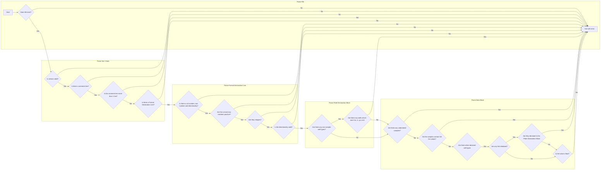

# Random Well-Plate Generator

A random Well Plate data generator written in C++.

---

# Libraries used

| Library                                        | version  |    
|------------------------------------------------|----------|
| [gflags](https://github.com/gflags/gflags)     | 2.2.2    | 
| [gtest](https://github.com/google/googletest)  | 1.12.1   |

--- 

## TODO:

- [ ] CLI 
  - [ ] accept path to input template 
  - [ ] accept number of plates to generate
  - [ ] accept equation type
    - [ ] EC50
    - [ ] IC50
    - [ ] XC50 - a mix of (E/I)C50
  - [ ] accept output format
    - [ ] CSV
    - [ ] TSV
    - [ ] Excel (xlsx)
  - [ ] accept output directory 
    - must exist prior to call 

- [x] template parser 
  - [x] read template file 
  - [x] parse template into internal representation of plate
    - [x] read + store file version 
    - [x] preallocate array of `cols`x`rows` dims
    - [x] set directionality 
  - [x] store values for parameters 
    - store in map 
    - convert `NA` to `NULL/nullptr` (decided to ignore or exit with error based off of whether value declared in format block or not)

- [x] data fuzzer  
  - [x] take internal template representation 
  - [x] create initial array of 0 vals 
  - [x] set values for all defined parameters (sx, hc, lc, pc, bl)
  - [x] for each `sx` (if present)
    - [x] iterate over the array in the defined manner (e.g. `LR`=`Left->Right`)
    - [x] based on ith col/row, perform dilution (e.g. 3rd col with df=10, perform dilution of 10^3)
  - [x] iterate over all values and 
    - [x] derive a value based on the supplied equation
    - [x] 'fuzz' derived data (add some noise to the data, using guassian distribution)
  - [x] data generated should be a 2d array of floating point values 

- [x] exporter 
  - [x] check `save-dir` is an existing directory 
    - [x] if not, exit program 
  - [x] write file to output directory 
    - [x] filename (generated as unix time stamp) 

- [ ] documentation 
  - [ ] add CLI help menu 
  - [x] create doc site for usage 
    - [x] documentation on file format 
    - [x] documentation on CLI usage 

- [ ] CI/CD
  - [ ] run some tests on each build 
  - [ ] job to build docs on push to docs dir 
  - [ ] job to build exe for win+linux on push to src 
  - [ ] job to auto-generate a changelog 
    - [ ] git commit messages should follow [conventional commits standards](https://gist.github.com/qoomon/5dfcdf8eec66a051ecd85625518cfd13)
    - [ ] [article on changelog generation from conventional commits](https://mokkapps.de/blog/how-to-automatically-generate-a-helpful-changelog-from-your-git-commit-messages/)

- [ ] allow user to run in _Interactive Mode_
    - [ ] CLI flag that gives user a TUI which will help for debugging
        - usage: `<exe> -t <path to template> <opts> -I`
    - [ ] print description of file to user
    - [ ] print plate format block
    - [ ] prompt user to continue
        - [ ] if yes continue
        - [ ] else exit program
    - [ ] show user a progress bar 

- [ ] implement template file param override (v2) 
  - e.g. override `s1=10` with `s1=20` (`--override 's1=10',<additional overrides>`)

- [ ] figure out some threading system (v2/3) 
  - default to 1 
  - provide CLI flag for specifying the number of execution threads 

- [ ] figure out how to introduce skips 

---

## Quality of life tooling 

- [ ] create website for template file generation 
  - [ ] build with [deno fresh](https://fresh.deno.dev/)
  - [ ] job to deploy app to [deno deploy](https://deno.com/deploy) 
  - [ ] single page app (react)
  
  - [ ] UIs 
    - [ ] provide reset button (clear form)
    - [ ] version specifier
      - radio buttons, mandatory, default to v1 (for now) 
    
    - [ ] comment text box
      - auto-expanding/wrapping text input, should not be "text box" widget, optional
    
    - [ ] row & col inputs (integer input) 
      - [ ] provide select box for 96, 384 & 1536 well plate defaults 
      - mandatory, default to 96-well plate dimensions
      - values must be greater than 0 
    
    - [ ] directionality specifier 
      - radio buttons, mandatory, default to `LR`
    
    - [ ] max dilutions input 
      - [ ] mandatory, default `None` (means that each row/col - depending on input - selected with "sample" type input 
      will be treated as a new sample; e.g. s1, s2 & s3 will appear on rows 1, 2 and 3 respectively)
      - NOTE: single point is done by entering `1` in the max dilutions input  
    
    - [ ] interactable grid 
      - [ ] provide undo/redo buttons 
      - [ ] resized automatically based on `rows`x`cols`
      - [ ] provide well type radio selector 
      - [ ] based on select type, when user clicks 2 wells, fill in the wells in that (x,y) range
      with the selected type (also generate number of samples) 
        - e.g. select sample type (with `max dilutions=3`) 
        - select wells a1, c9 (assumed 96-well plate format)
        - automatically each well in that range (a1-a9, b1-b9, c1-c9) should be filled out as `sample` type
        - number of samples that should be generated is 9
        - NOTE: sample number should only appear at start of new series (i.e. `s1,s,s,s2,s,s,...`)
        - NOTE: all non-sample types should be of same initial conc. 
        (expand this option later such that I can apply "max dilutions" to all types, maybe not blanks)
    
    - [ ] data block 
      - [ ] for each generated sample create a sample input form 
        - e.g. there are 3 distinct samples
        - create input for s1 `s1 [] []` which maps to "`<sample number>`, `<init conc>`, `<dilution factor>`" 
        - repeat generation for all samples 
        - if `max dilutions` set to `1`, create single sample entry field (`s1`)
      - if non-sample type well present in grid, set default value to 0
      - if non-sample type well not present, set field to non-editable `NA` value

- [ ] show form on LHS of page 
  - [ ] add option to automatically regenerate file on change to any fields 
    - regeneration should be after 500ms of inactivity 
  - [ ] if auto-refresh enabled, then enable "regenerate file" button
- [ ] show generated file in non-editable text box on RHS (preview) 
  - [ ] provide option to copy file to clipboard 
  - [ ] provide option to download file 
- [ ] create "onboarding" option ("take a tour" button to top of page)

--- 

## Custom template file format

Proposed file format for specifying template files for data generation.

- file extension: `.tplx`
- example of the format:

```
v1
# 96-well plate with a dilution scheme flowing L->R
12 8 LR
s1,s,s,s,s,s,s,s,s,s,hc,bl
s1,s,s,s,s,s,s,s,s,s,hc,bl
s1,s,s,s,s,s,s,s,s,s,hc,bl
s2,s,s,s,s,s,s,s,s,s,hc,bl
s2,s,s,s,s,s,s,s,s,s,bl,lc
s2,s,s,s,s,s,s,s,s,s,bl,lc
s2,s,s,s,s,s,s,s,s,s,bl,lc
s2,s,s,s,s,s,s,s,s,s,bl,lc
>>s1 10 10
>>s2 10 3
>>hc 10
>>lc 10
>>bl NA
>>pc NA
```

### format details

- `v<x>`: version specifier
- `# <template descriptor>`: comment line describing the template created; must be 1 line, **do not wrap**.
- declaration block:
    - `<x> <y>`: the `cols`x`rows` dimensions for the plate format (e.g. `12 8` means a `12` col x `8` row plate)
    - `<dir>`: specifies the directionality for a given sample dilution scheme. valid values:
        - `LR`: Left->Right (Top->Bottom)
        - `TB`: Top->Bottom (Left->Right)
- well plate format block:
    - CSV block of parameter names
    - contains information about what data is associated with each row/column in the template
        - e.g. for size `5 1` and the following format block `s  s  s  hc lc`
        - there are **3 distinct samples** (`s`)
        - there is 1 _high control_ sample (`hc`)
        - there is 1 _low control_ sample (`lc`)
- data block:
    - contains information about initialisation values for each masked value in the table
    - samples
        - `<sample id> <initial conc.> <dilution factor>`
    - high control
        - `hc <conc.>`
    - low control
        - `lc <conc.>`
    - blank
        - `bl <conc.>`
    - positive control
      - `pc <conc.>`

### usage notes 

- if you want to create a single point plate, then 
  - set all _sample_ wells to `s1`
  - set the `DF` column for `>>s1` to either _any float_ (e.g. `10`) or `NA`
  - for example:
```
...
10 1 LR
s1,s1,s1,s1,s1,s1,s1,s1,hc,lc
>>s1 10 NA
...
```



