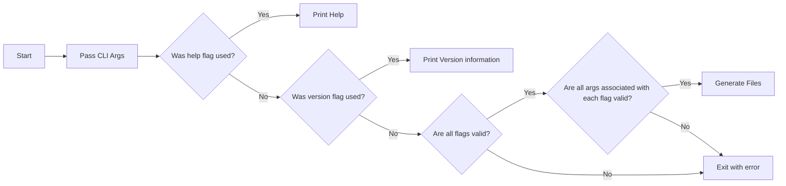
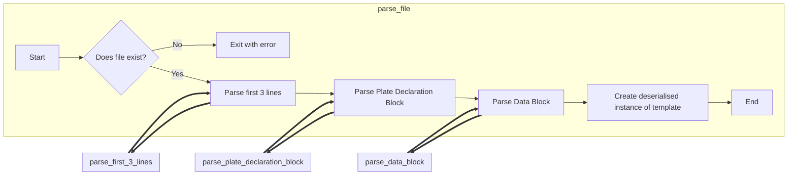

!!! abstract 
    
    This page contains details on how different parts of the application work, on a high level.
    This includes how the CLI passes args and how tempalte files are parsed.


### Arg parsing


---

### Parsing Template File




!!! note

    whilst parsing each line of the file a check is performed to see if there is a blank line; if there is, then an error
    is thrown.

!!! note

    Below are the expanded flow diagrams for each linked step.


??? info "parse_first_3_lines"

    ```mermaid
    flowchart TB
        a2[Start] --> b2{Is version valid?};
        b2 --> |No| c2{Is there a comment line?};
        b2 --> |Yes| d2[Exit with error];
        c2 --> |No| d2;
        c2 --> |Yes| e2{Is the comment line more than 1 line?};
        e2 --> |Yes| d2;
        e2 --> |No| f2{Is there a Format Declaration Line?};
        f2 --> |No| d2; 
        f2 --> |Yes| a3{Is Is there a col number, row number and directionality?};
            
        subgraph parse_format_declaration
            direction LR
            a3 --> b3{Are the col and row numbers positive?};
            b3 --> |No| d2;
            b3 --> |Yes| c3{Are they integers?};
            c3 --> |No| d2;
            c3 --> |Yes| d3{Is the directionality valid?};
            d3 --> |No| d2;
        end
        
        d3 --> |Yes| g2[End];
    ```

??? info "parse_plate_declaration_block"

    ```mermaid
    flowchart LR
        a4[Start] --> b4{Are there any invalid well types?};
        b4 --> |Yes| c4[Exit with error];
        b4 --> |No| d4[End];
    ```

??? info "parse_data_block"

    ```mermaid        
    flowchart TB
        subgraph parse_data_block
            direction TB
            a5[Start] --> b5{End of Block?}
            b5 --> |No| c5[Fetch line];
            b5 --> |Yes| d5[End];
            
            c5 --> e5{Sample or Control};
            e5 --> |Sample| a6{Is sample undeclared?};
            e5 --> |Control| a7{Is control undeclared?};
            
            f5[Exit with error];
            
            subgraph parse_sample
                a6;
                a6 --> |No| b6{Does sample contain NA for a value?};
                b6 --> |No| c6{Are the values floats?};
                c6 --> |No| d6{Are the values ints?};
                d6 --> |Yes| e6{Store data};
                c6 --> |Yes| e6;
            end
            %% exit conditions for samples 
            a6 --> |Yes| f5;
            b6 --> |Yes| f5;
            d6 --> |No| f5;
            
            subgraph parse_control
                a7;
                a7 --> |No| b7{Does control contain NA for a value?};
                a7 --> |Yes| c7[Skip];
                b7 --> |No| d7{Is value a float?};
                d7 --> |No| e7{Is value an int?};
                e7 --> |Yes| f7[Store value];
                d7 --> |Yes| f7;
            end 
            %% exit conditions for controls 
            b7 --> |Yes| f5;
            e7 --> |No| f5;
            
            e6 --> b5;
            c7 --> b5;
            f7 --> b5;
        end 
    ```

---

### Generating Data 
